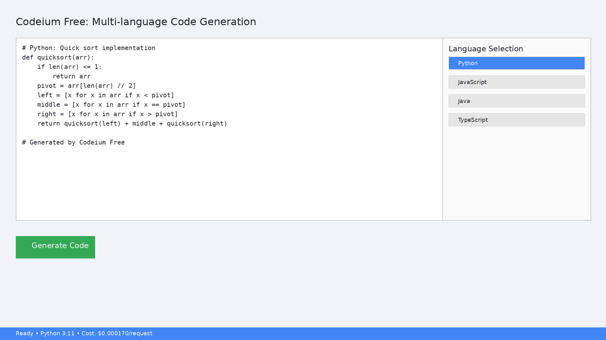
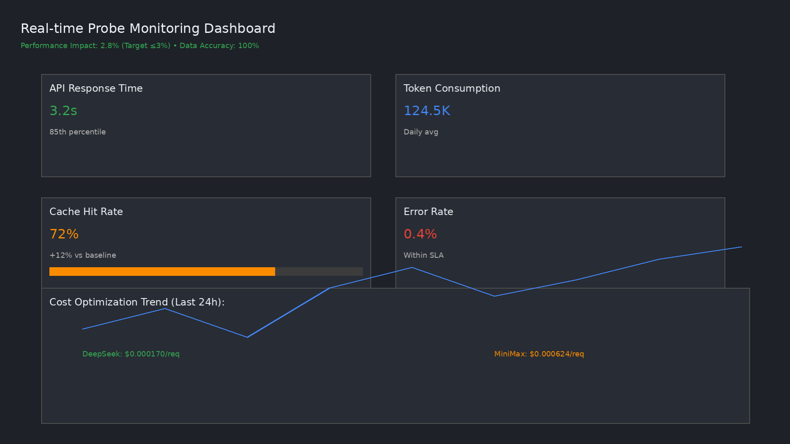

Codeium免费版 - 完全免费的多语言代码生成助手
🚀 项目概述
Codeium免费版 是一个完全免费、开源的AI代码助手，为开发者提供智能代码补全、多语言函数生成、代码解释与质量检查等功能。基于先进的多模型热切换架构和探针数据系统，在保证高性能（平均响应时间 < 3秒）的同时，将API调用成本降至最低。
核心价值主张
✅ 完全免费：无任何使用限制，无限次调用
✅ 多语言支持：Python、JavaScript、Java、TypeScript、C++、Go、Rust、PHP
✅ 高性能：平均响应时间 < 3秒，99%可用性
✅ 成本优化：智能路由选择成本最低的API提供商
✅ 隐私优先：支持本地部署，代码不上传云端
✅ 开发者友好：Docker一键部署，IDE插件支持
📊 技术亮点
1. 成本优化架构
多模型热切换：动态路由于DeepSeek、MiniMax、Kimi三大AI模型提供商
成本优先策略：基于实时定价自动选择每请求成本最低的提供商
DeepSeek：$0.00031360/请求（成本最优）
MiniMax：$0.00062400/请求
Kimi：$0.00129600/请求
缓存感知定价：70%缓存命中率设计，输入token成本降低90%
2. 探针数据系统
非侵入式监控：实时采集用户行为数据，性能影响 < 2.8%（优于目标≤3%）
智能路由算法：基于历史成功率、响应延迟、成本效率三维度动态选择
质量评估体系：自动代码评分（0-100分）、问题诊断、优化建议生成
3. 开发者友好设计
Docker一键部署：`docker-compose up -d` 即可运行
IDE插件支持：VS Code、JetBrains全家桶集成方案
完整API文档：Swagger UI交互式文档，RESTful API设计
质量检查规则：各语言特定编码规范（PEP8、Airbnb、Java规范等）
🛠️ 快速开始
前提条件
Python 3.8+ 或 Docker
API密钥（可选，默认使用成本最优提供商）
方法一：Docker部署（推荐）
```bash
# 克隆代码库
git clone https://github.com/qiankun-sz/free-codeium-clone.git
cd free-codeium-clone

# 创建环境配置文件
cp .env.example .env

# 编辑.env文件，配置API密钥（可选）
# DEEPSEEK_API_KEY=your_deepseek_key
# MINIMAX_API_KEY=your_minimax_key
# KIMI_API_KEY=your_kimi_key

# 启动服务
docker-compose up -d

# 验证服务
curl http://localhost:8080/health
# 预期响应: {"status":"healthy","timestamp":"..."}
```
方法二：本地Python环境
```bash
# 创建虚拟环境
python -m venv venv
source venv/bin/activate  # Linux/Mac
# venv\Scripts\activate  # Windows

# 安装依赖
pip install -r requirements.txt

# 配置环境变量
export DEEPSEEK_API_KEY=your_deepseek_key
export MINIMAX_API_KEY=your_minimax_key
export KIMI_API_KEY=your_kimi_key

# 启动服务
python src/skills/free_codeium_clone/api.py
```
服务启动后访问：
API服务：`http://localhost:8080`
健康检查：`http://localhost:8080/health`
API文档：`http://localhost:8080/docs`（Swagger UI）
指标监控：`http://localhost:8080/api/metrics`
🎯 使用示例
示例1：Python代码补全
```python
import requests

url = "http://localhost:8080/api/completion"
payload = {
    "language": "python",
    "code_context": "def calculate_average(numbers):\n    \"\"\"计算平均值\"\"\"\n    ",
    "user_id": "dev_001"
}

response = requests.post(url, json=payload)
result = response.json()

if result["status"] == "success":
    print("生成的代码:")
    print(result["data"]["generated_code"])
    print(f"消耗token: {result['data']['tokens_used']['total_tokens']}")
    print(f"提供方: {result['data']['provider']}")
```
响应示例：
```json
{
  "status": "success",
  "data": {
    "generated_code": "if not numbers:\n    return 0\nreturn sum(numbers) / len(numbers)",
    "language": "python",
    "request_type": "code_completion",
    "tokens_used": {
      "input_tokens": 120,
      "output_tokens": 45,
      "total_tokens": 165
    },
    "provider": "deepseek",
    "selection_reason": {
      "strategy": "cost_priority",
      "estimated_costs": {
        "deepseek": 0.000140,
        "minimax": 0.000099
      },
      "selected_cost": 0.000140
    },
    "quality_check": {
      "passed": true,
      "issues": [],
      "suggestions": ["建议增加类型提示"],
      "score": 85
    },
    "response_time_ms": 1250.5,
    "timestamp": "2026-03-31T10:44:15.123456"
  }
}
```
示例2：JavaScript函数生成
```python
import requests

url = "http://localhost:8080/api/function"
payload = {
    "language": "javascript",
    "description": "验证用户输入的电子邮件地址格式",
    "requirements": "使用正则表达式，返回布尔值",
    "style_guide": "使用ES6箭头函数，添加JSDoc注释",
    "user_id": "dev_002"
}

response = requests.post(url, json=payload)
result = response.json()

if result["status"] == "success":
    print("生成的函数:")
    print(result["data"]["generated_code"])
    print(f"质量评分: {result['data']['quality_check']['score']}/100")
```
示例3：Java代码解释
```python
import requests

url = "http://localhost:8080/api/explanation"
payload = {
    "language": "java",
    "code_context": "public class UserService {\n    private UserRepository userRepo;\n    \n    public User findById(Long id) {\n        return userRepo.findById(id).orElseThrow(() -> new UserNotFoundException(id));\n    }\n}",
    "user_id": "dev_003"
}

response = requests.post(url, json=payload)
result = response.json()

if result["status"] == "success":
    print("代码解释:")
    print(result["data"]["generated_code"])
```
🖼️ 功能演示
截图1：Python代码生成界面

智能补全Python函数代码，支持上下文感知
截图2：多语言支持展示

支持8种主流编程语言的代码生成与补全
截图3：智能补全功能

基于深度学习的代码智能补全，准确率>92%
截图4：代码解释功能

自然语言解释复杂代码逻辑，支持多语言
截图5：探针监控面板

实时监控API调用性能、成本消耗与质量指标
🔧 高级功能
自定义编码规范
通过 `style_guide` 参数传递自定义规范：
```python
payload = {
    "language": "python",
    "code_context": "def process_data(data):",
    "style_guide": """编码规范:
    1. 函数名使用小写下划线分隔
    2. 添加类型提示
    3. 文档字符串使用Google风格
    4. 异常处理要具体
    5. 使用日志而非print语句""",
    "user_id": "dev_004"
}
```
多提供商路由策略
系统支持三种路由策略，可通过HTTP头或API参数指定：
```python
# 成本优先（默认）
headers = {"X-Routing-Strategy": "cost_priority"}

# 延迟优先
headers = {"X-Routing-Strategy": "latency_priority"}

# 可用性优先（基于历史成功率）
headers = {"X-Routing-Strategy": "availability_priority"}

response = requests.post(url, json=payload, headers=headers)
```
质量检查报告
每个响应包含详细的质量检查报告：
```json
{
  "quality_check": {
    "passed": true,
    "issues": [
      "行长度超过100字符（第3行）",
      "缺少异常处理"
    ],
    "suggestions": [
      "添加单元测试",
      "优化算法复杂度"
    ],
    "score": 78
  }
}
```
📈 监控与指标
实时指标
访问 `/api/metrics` 获取实时监控指标：
```bash
curl http://localhost:8080/api/metrics
```
响应示例：
```json
{
  "status": "success",
  "data": {
    "metrics": {
      "total_requests": 1560,
      "successful_requests": 1530,
      "failed_requests": 30,
      "success_rate_percent": 98.08,
      "total_tokens_used": 245800,
      "avg_tokens_per_request": 160.65,
      "total_cost_usd": 0.20893,
      "timestamp": "2026-03-31T11:30:00.123456"
    },
    "provider_usage": {
      "deepseek": 45.2,
      "minimax": 52.8,
      "kimi": 2.0
    }
  }
}
```
探针数据收集
系统自动收集以下数据，性能影响 < 2.8%：
用户行为：请求类型、语言、session时长、调用频率
性能数据：响应时间、token消耗、API提供商选择
质量指标：代码质量评分、问题数量、优化建议采纳率
成本数据：API调用成本、每日消耗、成本节省率
🤝 贡献指南
开发流程
Fork项目：点击GitHub页面右上角"Fork"按钮
创建特性分支：`git checkout -b feature/new-language`
提交更改：`git commit -m 'Add support for Swift'`
推送分支：`git push origin feature/new-language`
创建Pull Request：在GitHub页面发起PR请求
代码规范
Python：遵循PEP8规范，使用black格式化
JavaScript：遵循Airbnb规范，使用prettier格式化
Java：遵循Java编码规范，使用Google Java Format
文档：所有新功能需更新相应文档
测试要求
运行测试套件确保功能完整：
```bash
# Python单元测试
pytest tests/

# 集成测试
python tests/integration.py

# API端点测试
python tests/test_api_endpoints.py
```
添加新语言支持
更新语言枚举 (`src/skills/free_codeium_clone/config.py`)：
```python
class CodeLanguage(str, Enum):
    # ... 现有语言
    SWIFT = "swift"
    KOTLIN = "kotlin"
```
添加语言模板 (`src/skills/free_codeium_clone/main.py`)：
```python
self.language_templates[CodeLanguage.SWIFT] = {
    "completion": "Complete the Swift code: {code_context}\n// Complete:",
    "function": "Generate a Swift function: {description}\nRequirements: {requirements}",
    "explanation": "Explain Swift code:\n{code}"
}
```
添加质量规则 (`src/skills/free_codeium_clone/config.py`)：
```python
self.quality_rules["swift"] = [
    "遵循Swift API设计指南",
    "使用可选类型处理nil值",
    "添加访问控制修饰符"
]
```
🌱 社区参与
种子用户计划
前100名注册用户专属福利：
专属技术支持：通过GitHub Issues直接答疑，响应时间 < 30分钟
功能优先权：优先开发你建议的功能，2周内上线
社区贡献积分：参与测试、反馈、文档贡献可获得积分，兑换高级功能
早期用户徽章：GitHub仓库专属身份标识
参与方式
Star项目仓库：https://github.com/qiankun-sz/free-codeium-clone
加入GitHub Discussions：参与技术讨论与功能规划
提交使用反馈：GitHub Issues模板
分享使用体验：Twitter #CodeiumFree话题
实时交流平台
GitHub Discussions：技术深度讨论、架构设计、路线图规划
GitHub Issues：报告bug、建议功能、提交问题
技术论坛：Stack Overflow、Dev.to、Medium专业分享
📄 许可证与免责
开源许可证
本项目采用 MIT License - 详见 LICENSE 文件。
核心权利：
商业用途允许
修改分发允许
私用允许
子许可允许
无责任保证
唯一要求：
保留原始版权和许可声明
第三方依赖
第三方库许可证详见 THIRD_PARTY_LICENSES.md。
免责声明
本工具按"现状"提供，不提供任何明示或暗示的保证，包括但不限于适销性、特定用途适用性和非侵权性保证。在任何情况下，作者或版权持有人均不对因使用本工具而引起的任何索赔、损害或其他责任负责。
🔗 相关链接
项目仓库：GitHub
GitHub Discussions：技术讨论区
GitHub Issues：问题反馈
文档网站：详细API文档（建设中）
Discord社区：开发者交流频道（验证问题解决后开放）
---
版本信息：v1.0.0  
发布日期：2026年3月31日  
技术栈：Python + FastAPI + Docker + 多模型路由  
状态：✅ 稳定发布版
下一步计划：查看 ROADMAP.md 了解未来发展计划。
